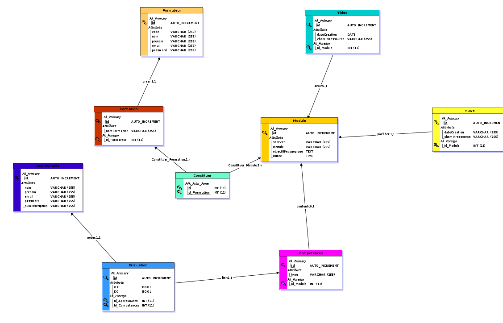

# Resumé

### Demande client

>Les formations sont organisés en modules.
>Chaque module est caractérisé par un numéro de module sous forme de Semantic Versionning, un intitulé, un objectif pédagogique, un contenu (textes, images et vidéos), une durée en heures, un ou plusieurs tags et un auteur.

>Un module peut faire partie d'une ou plusieurs formations, comme par exemple un pire module "Commandes de base Git" pourrait faire partie d'une pire formation "Frontend Javascript" et "DevOps", voir  plus.
>Un module peut contenir un texte et/ou une image et/ou une vidéo.

>Les apprenants peuvent s'inscrire à une ou plusieurs formations, ils peuvent choisir de ne pas suivre certains des modules s'ils possèdent déjà, par exemple, les compétences. Autrement dit, ils peuvent arbitrairement valider les modules de leur choix en un clic.

>Chaque apprenant est évalué pour chaque module et possède un état de fin de module (OK / KO).

>Une formation est considérée comme terminée lorsque tous les modules ont été validés.

>Chaque apprenant est caractérisé par un numéro d’inscription unique, un nom, un prénom, une adresse et une date de naissance.

>Un formateurs est auteur d'un module pour une formation donnée, chaque formateur est caractérisé par un code, un nom, un prénom.


### Livrables
>Un dépôt Github recensant :
>* Un README explicite et soigné
>* Une définition de l'acronyme MERISE dans le README.md
>* Un dictionnaire de données
>* Des règles de gestion
>* Un MCD
>* Un MLD
>* Un MPD
>* Un script SQL de la base de données

# Mon travail

## Definition Merise

>MERISE est une méthode d'analyse et de conception des systèmes d'information basée sur le principe de la séparation des données et des traitements. Elle possède plusieurs modèles qui sont répartis sur 3 niveaux (Le niveau conceptuel, le niveau logique ou organisationnel, le niveau physique).

## M.C.D. (Modèle concptuel de Données)

>

## M.L.D. (Modèle Logique de Données)

>Module 
>* id(primary_key, auto-incremente)
>* semVer(varchar 255)
>* intitule(varchar 255)
>* objectifPedagogique(time)


>Video
>* id(primary_key, auto-incremente)
>* dateCreation(date)
>* cheminRessource(varchar 255)
>* #id_module(foreign_key)

>Image
>* id(primary_key, auto-incremente)
>* dateCreation(date)
>* cheminRessource(varchar 255)
>* #id_module(foreign_key)

>Competence
>* id(primary_key, auto-incremente)
>* type(varchar 255)
>* #id_module(foreign_key)

>Apprenant
>* id(primary_key, auto-incremente)
>* nom(varchar 255)
>* prenom(varchar 255)
>* email(varchar 255)
>* password(varchar 255)
>* numInscription(varchar 255)


>Evaluation
>* id(primary_key, auto-incremente)
>* ok(bool)
>* ko(bool)
>* #id_competence(foreign_key)
>* #id_apprenant(foreign_key)

>Formateur
>* id(primary_key, auto-incremente)
>* nom(varchar 255)
>* prenom(varchar 255)
>* email(varchar 255)
>* password(varchar 255)
>* code(varchar 255)

>Formation
>* id(primary_key, auto-incremente)
>* nomFormation(varchar 255)
>* #id_formateur(foreign_key)

>Constituer
>* (id_module,id_formation)(primary_key)


## M.P.D. (Modèle Physique de Données)
>

## SQL bdd

```sql
#------------------------------------------------------------
#        Script MySQL.
#------------------------------------------------------------


#------------------------------------------------------------
# Table: Module
#------------------------------------------------------------

CREATE TABLE Module(
        id                  Int  Auto_increment  NOT NULL ,
        semVer              Varchar (255) NOT NULL ,
        intitule            Varchar (255) NOT NULL ,
        objectifPedagogique Text NOT NULL ,
        Duree               Time NOT NULL
	,CONSTRAINT Module_PK PRIMARY KEY (id)
)ENGINE=InnoDB;


#------------------------------------------------------------
# Table: Video
#------------------------------------------------------------

CREATE TABLE Video(
        id              Int  Auto_increment  NOT NULL ,
        dateCreation    Date NOT NULL ,
        cheminRessource Varchar (255) NOT NULL ,
        id_Module       Int NOT NULL
	,CONSTRAINT Video_PK PRIMARY KEY (id)

	,CONSTRAINT Video_Module_FK FOREIGN KEY (id_Module) REFERENCES Module(id)
	,CONSTRAINT Video_Module_AK UNIQUE (id_Module)
)ENGINE=InnoDB;


#------------------------------------------------------------
# Table: Image
#------------------------------------------------------------

CREATE TABLE Image(
        id              Int  Auto_increment  NOT NULL ,
        dateCreation    Varchar (255) NOT NULL ,
        cheminressource Varchar (255) NOT NULL ,
        id_Module       Int NOT NULL
	,CONSTRAINT Image_PK PRIMARY KEY (id)

	,CONSTRAINT Image_Module_FK FOREIGN KEY (id_Module) REFERENCES Module(id)
	,CONSTRAINT Image_Module_AK UNIQUE (id_Module)
)ENGINE=InnoDB;


#------------------------------------------------------------
# Table: Formateur
#------------------------------------------------------------

CREATE TABLE Formateur(
        id       Int  Auto_increment  NOT NULL ,
        code     Varchar (255) NOT NULL ,
        nom      Varchar (255) NOT NULL ,
        prenom   Varchar (255) NOT NULL ,
        email    Varchar (255) NOT NULL ,
        password Varchar (255) NOT NULL
	,CONSTRAINT Formateur_PK PRIMARY KEY (id)
)ENGINE=InnoDB;


#------------------------------------------------------------
# Table: Formation
#------------------------------------------------------------

CREATE TABLE Formation(
        id           Int  Auto_increment  NOT NULL ,
        nomFormation Varchar (255) NOT NULL ,
        id_Formateur Int NOT NULL
	,CONSTRAINT Formation_PK PRIMARY KEY (id)

	,CONSTRAINT Formation_Formateur_FK FOREIGN KEY (id_Formateur) REFERENCES Formateur(id)
)ENGINE=InnoDB;


#------------------------------------------------------------
# Table: Appreunants
#------------------------------------------------------------

CREATE TABLE Appreunants(
        id             Int  Auto_increment  NOT NULL ,
        nom            Varchar (255) NOT NULL ,
        prenom         Varchar (255) NOT NULL ,
        email          Varchar (255) NOT NULL ,
        password       Varchar (255) NOT NULL ,
        numInscription Varchar (255) NOT NULL
	,CONSTRAINT Appreunants_PK PRIMARY KEY (id)
)ENGINE=InnoDB;


#------------------------------------------------------------
# Table: Competences
#------------------------------------------------------------

CREATE TABLE Competences(
        Id        Int  Auto_increment  NOT NULL ,
        type      Varchar (255) NOT NULL ,
        id_Module Int
	,CONSTRAINT Competences_PK PRIMARY KEY (Id)

	,CONSTRAINT Competences_Module_FK FOREIGN KEY (id_Module) REFERENCES Module(id)
)ENGINE=InnoDB;


#------------------------------------------------------------
# Table: Evaluation
#------------------------------------------------------------

CREATE TABLE Evaluation(
        id             Int  Auto_increment  NOT NULL ,
        OK             Bool NOT NULL ,
        KO             Bool NOT NULL ,
        id_Appreunants Int NOT NULL ,
        Id_Competences Int NOT NULL
	,CONSTRAINT Evaluation_PK PRIMARY KEY (id)

	,CONSTRAINT Evaluation_Appreunants_FK FOREIGN KEY (id_Appreunants) REFERENCES Appreunants(id)
	,CONSTRAINT Evaluation_Competences0_FK FOREIGN KEY (Id_Competences) REFERENCES Competences(Id)
)ENGINE=InnoDB;


#------------------------------------------------------------
# Table: Constituer
#------------------------------------------------------------

CREATE TABLE Constituer(
        id           Int NOT NULL ,
        id_Formation Int NOT NULL
	,CONSTRAINT Constituer_PK PRIMARY KEY (id,id_Formation)

	,CONSTRAINT Constituer_Module_FK FOREIGN KEY (id) REFERENCES Module(id)
	,CONSTRAINT Constituer_Formation0_FK FOREIGN KEY (id_Formation) REFERENCES Formation(id)
)ENGINE=InnoDB;


```

​
## Règles de gestion
>

## Dictionnaire de données
>

